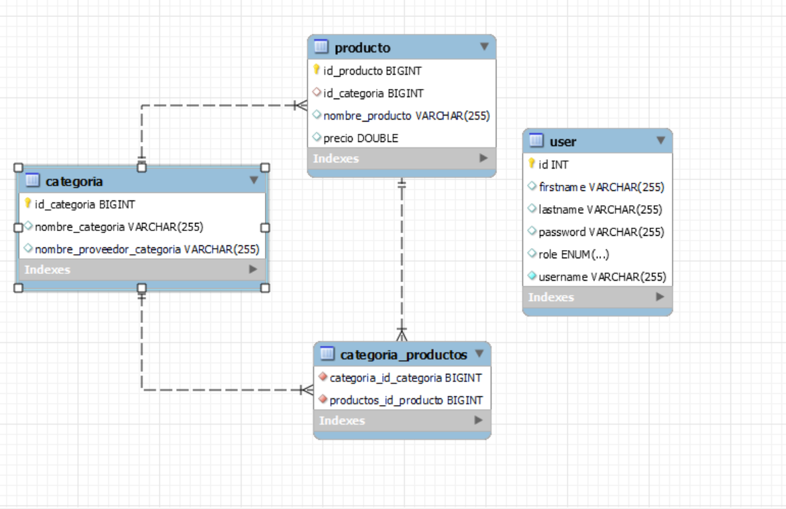

# Documentación de API Rest Inventario

Se realizo un CRUD utilizando la implementacion de JWT Y Spring Boot.

## Tecnologias utilizadas:
* Spring Boot 
* Spring Security
* jsonwebtoken
* Hibernate
* MYSQL
* Lombok
* Jakarta

## MODELO BASE DE DATOS

## Accesos
Tener en cuenta la configuracion de la base de datos, en este caso la realice en mi localhost y el nombre del esquema es PROYECTO_FINAL, pido por favor colocar los datos respectivos de la base de datos MYSQL donde se requieren hacer pruebas





```javascript
spring.datasource.url= jdbc:mysql://localhost:3306/PROYECTO_FINAL
spring.datasource.username=root
spring.datasource.password=12345
spring.datasource.driver-class-name=com.mysql.jdbc.Driver
spring.jpa.hibernate.ddl-auto=update

```

## Acceso a la UI de la documentación de la API mediante POSTMAN COLLECTION 

Adjunto link a la coleccion de Postman para poder ejecutar las APIs
```
API_INVENTARIO_PRODUCTOS.postman_collection.json
```
Pido mil disculpas no tener la documentacion en Swagger, tuve un incoveniente y por mas que intente cargar las APIs nunca lo hizo, creo que es tema del JWT, intente desviar la ip de swagger para que estuviera fuera de JWT pero no me funciono
